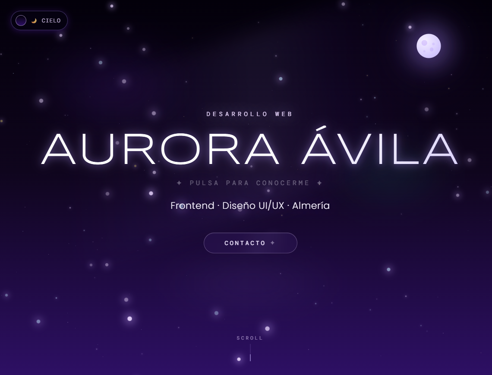

<div align="center">

# ✦ Aurora Ávila — Portfolio ✦

### Desarrolladora Web Frontend · Diseño UI/UX · Almería

Un portfolio interactivo con un cielo animado que cambia según la hora del día, constelaciones navegables y un sistema de temas dinámico construido desde cero.

[](https://aviz-portfolio.vercel.app/)


</div>

---

## 📸 Vista previa

<div align="center">
  
</div>

---

## ✨ Sobre el proyecto

Este portfolio no usa una plantilla: cada sección —el fondo del cielo, las constelaciones de proyectos y habilidades, las animaciones de entrada— está construida a medida con React y Framer Motion.

**Lo más destacado:**

- 🌅 **4 modos de cielo** (amanecer, mediodía, atardecer, noche) que se adaptan automáticamente a la hora del visitante, con paleta de color, estrellas y nubes propias para cada uno.
- ⭐ **Constelaciones interactivas** — los proyectos y habilidades se presentan como estrellas conectadas por líneas, con paneles de detalle que se abren al pulsar.
- 🎨 **Diseño 100% propio** — sin librerías de UI genéricas; cada componente, sombra y degradado está diseñado a mano.
- 📱 **Totalmente responsive**, con lógica adaptativa que reduce la carga visual en móvil sin perder la esencia del diseño.
- ⚡ **Optimizado para rendimiento** — Lighthouse 99+ en Accessibility, Best Practices y SEO.

---

## 🛠️ Stack técnico

| Categoría | Tecnologías |
|---|---|
| **Frontend** | React, Framer Motion |
| **Build tool** | Vite |
| **Estilos** | CSS-in-JS (inline styles), variables de tema dinámicas |
| **Despliegue** | Vercel |
| **Diseño** | Figma, Adobe Illustrator |

---

## 📂 Proyectos incluidos

El portfolio muestra 7 proyectos propios, entre ellos:

- **Turistea** — App fullstack de agencia de viajes (PHP, MySQL, JavaScript, Bootstrap)
- **Superverde** — E-commerce vegano con diseño de marca propio (HTML5, CSS3, JS)
- **DavanteDent** — Sistema de gestión de citas dentales sin frameworks
- **Organizador de Proyectos** y **Tareando** — Backends en Spring Boot con API REST y MySQL

Cada proyecto tiene su repositorio y, cuando aplica, demo en vivo — visibles directamente en las constelaciones interactivas del portfolio.

---

## 🚀 Instalación local

Clona el repositorio y arráncalo en tu máquina:

```bash
# Clona el repositorio
git clone https://github.com/auroraaviz/portfolio.git

# Entra en la carpeta del proyecto
cd portfolio

# Instala las dependencias
npm install

# Arranca el servidor de desarrollo
npm run dev
```

El proyecto se abrirá por defecto en `http://localhost:5173`.

### Compilar para producción

```bash
npm run build
```

Los archivos optimizados se generarán en la carpeta `dist/`.

---

## 📬 Contacto

- **Email:** auroraavilaizquierdo@gmail.com
- **LinkedIn:** [aurora-avila-dev](https://linkedin.com/in/aurora-avila-dev)
- **GitHub:** [@auroraaviz](https://github.com/auroraaviz)

---

<div align="center">

Hecho con ✦ y React por Aurora Ávila Izquierdo · 2026

</div>
